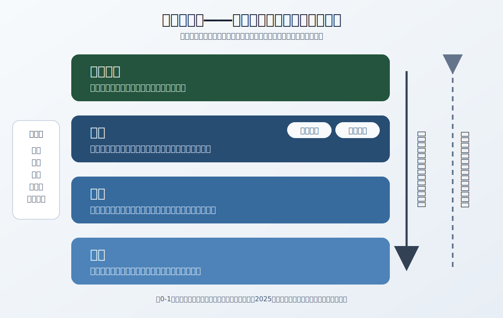

# 現代戦術と指揮

図解で学ぶ、戦術・作戦・指揮の基礎と現代的課題。

> **執筆中／資料基準日：2026年7月12日**  
> 本書は段階的に制作している。用語と分析枠組みを整え、各章の本文・図版・演習を順次追加する。

## 本書の目的

「戦術」を個々の戦闘技法だけとして扱わず、政策目的、戦略、作戦、組織、情報、兵站、指揮官の判断がつながる体系として理解するための入門書である。成人の一般読者、ミリタリー史・安全保障研究の愛好家、読書会や図上討議の参加者を主な対象とする。

日本・米国・NATOの公開ドクトリンと公式資料、主要な戦史研究を参照し、図解と事例を用いて概念を整理する。特定の紛争当事者を利する作戦助言ではなく、歴史・制度・意思決定を分析する教育資料として執筆する。

## 目次

### 序章　戦術と指揮の基本概念

- 米統合ドクトリンの三水準と米陸軍の四水準
- 作戦術（Operational Art）
- 指揮、統制、ミッションコマンド
- 統合、領域横断、多領域作戦
- 図解の読み方と資料の時点

### 第I部　戦術理論

1. 戦術判断を支える原則――状況に応じた適用
2. 戦術単位と兵科連携――編制と相互補完

### 第II部　指揮理論・実践

3. 指揮官の意思決定――OODAと軍事的意思決定過程
4. ミッションコマンド――意図、自律、統制
5. 指揮統制システム――抗たん性あるC2、データ、AI、情報共有

### 第III部　戦史に学ぶ

6. 古典会戦の教訓――ナポレオン戦争とプロイセン
7. 近代戦の戦術革新――世界大戦と太平洋戦
8. 冷戦・現代戦の対立――ドクトリン、非対称戦、情報戦

### 第IV部　現代戦術の重要テーマ

9. 統合・多領域作戦――陸・海・空・宇宙・サイバーと軍事外活動
10. 兵站と持久力――補給線、継戦能力、競争下の兵站

### 第V部　指揮官と組織文化

11. 指揮官のリーダーシップ――資質、倫理、責任
12. 組織文化と教訓――硬直化、失敗、学習

### 終章　まとめと展望

- 日本における戦術研究
- 図解思考の応用
- 継続的な学習と検証

## 現在の原稿

- [序章：戦術と指揮の基本概念](manuscript/00-introduction.md)
- [2026年7月の公開ドクトリン更新調査](research/2026-07-12-doctrine-update.md)
- [参考文献](references.md)
- [執筆・提案ガイド](CONTRIBUTING.md)
- [執筆ロードマップ](ROADMAP.md)
- [プライバシー方針](PRIVACY.md)

## 資料の鮮度

2026年7月12日時点の基準は次のとおり。

- 日本の最新年次防衛白書は令和7年版。2026年の状況は、統合作戦司令部発足1周年後の公式発表と令和8年度成立予算で補う。
- 米統合ドクトリンはJP 3-0（2022年）を、米陸軍の作戦ドクトリンはADP 3-0／FM 3-0（2025年）を基準とする。
- 戦術の基準資料にはFM 3-90（2023年）を、ミッションコマンドにはADP 6-0（2019年）を用いる。
- NATOのデジタル・C2分野にはAlliance Digital StrategyとDigital Transformation Implementation Strategy 2.0（ともに2026年）を反映する。

時点に依存する記述には確認日または資料の年版を付ける。新しい版が出た場合は、旧版との差分と用語変更を確認してから本文を更新する。

## 図版の原則

共通色は、青＝自組織、赤＝競合する意思、緑＝目的、灰＝環境・制約を基本とする。ただし、概念図では色を階層や段階の区別に用いる場合があるため、**各図のタイトル、説明、個別凡例を優先する**。

図は概念を理解するための模式図であり、実在する部隊配置、正確な縮尺、個別の作戦計画を示すものではない。色だけに依存せず、文字、形、線種でも意味を区別する。

## 出典と更新方針

重要な定義や現在の制度に関する記述には、可能な限り公開された一次資料へのリンクを付ける。IssueやPull Requestで寄せられた指摘は、出典、論旨、著作権、安全性、プライバシーを確認したうえで反映する。リポジトリ所有者や関係者の個人情報は公開物に含めない。
