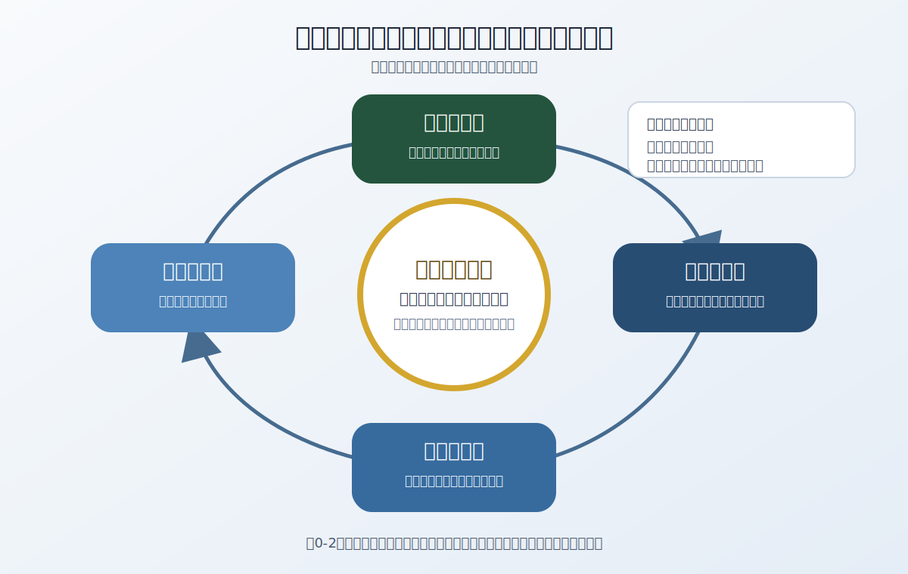

# 序章　戦術と指揮の基本概念

> **資料基準日：2026年7月13日**
>
> 本章は、公開された日本・米国・NATOの資料を同日時点で確認している。令和8年版防衛白書は未公表のため、日本の最新状況は令和7年版防衛白書、2026年の防衛省・統合作戦司令部の発表、令和8年度成立予算で補っている。

## 1　なぜ戦術だけを切り離してはならないのか

戦術を学び始めると、隊形、火力、機動、奇襲といった目に見える要素に関心が集まりやすい。しかし、戦術行動の価値は、その場で優勢だったかどうかだけでは決まらない。ある行動が上位の目的に貢献し、許容できる費用と危険の範囲で、望ましい状態へ近づけたかによって評価される。

したがって本書は、「どう戦うか」より先に、次の問いを置く。

1. 何を実現しようとしているのか。
2. なぜ、その状態が望ましいのか。
3. 行動は上位の目的とどのようにつながるのか。
4. どの前提が崩れたら、判断を見直すのか。
5. 失敗、想定外、相手の適応から何を学び直すのか。

この順序は、軍事行動を政治目的から切り離さないために重要である。同時に、戦術的な成功が自動的に戦略的な成功になるわけではないことを理解する手がかりにもなる。

## 2　戦争の水準――一つの正解ではなく分析の枠組み

### 2.1　米統合ドクトリンの三水準

米統合ドクトリンのJP 3-0（2022年）は、戦争を理解する基本枠組みとして**戦略・作戦・戦術**という三つの水準を用いる。これらは固定した箱ではない。司令部の名称、部隊の人数、装備の種類だけで決まるのではなく、行動が達成しようとする目的の性質によって定まる。

### 2.2　米陸軍2025年版の四水準

米陸軍のADP 3-0とFM 3-0は2025年3月21日に改定され、**国家戦略・戦域戦略・作戦・戦術**の四水準を明示している。これは三水準モデルとの矛盾ではない。統合ドクトリンがまとめて扱う戦略水準を、陸軍が責任と活動の違いに着目して二つに分けたものである。

- **国家戦略水準**：政府が政策目標と、その達成方法を構成する。
- **戦域戦略水準**：戦域を担当する指揮官が、国家戦略を支える戦域上の構想を組み立てる。
- **作戦水準**：戦役と作戦を計画・実施・持続し、戦術行動を戦略目的へ結ぶ。
- **戦術水準**：戦闘と交戦を計画・実行し、軍事目標を達成する。

**図0-1　戦争の水準と目的の連鎖。** 図では見通しをよくするため戦略を一つの帯にまとめ、その内部に国家戦略と戦域戦略を示した。下向きの矢印は目的の具体化を、上向きの破線は結果・評価・学習の還流を表す。

### 2.3　規模ではなく目的を見る

「小部隊なら戦術、大部隊なら作戦、政府なら戦略」と機械的に対応させるのは誤りである。小規模な行動が国際的な情報環境を通じて戦略的影響を生む場合も、国家級の情報・宇宙資産が個々の戦術行動を直接支える場合もある。

分類するときは、規模よりも次の四点を見る。

- **目的**：その行動は何を達成しようとしているか。
- **接続**：得られた結果は、上位・下位の活動とどうつながるか。
- **時間幅**：効果をどの期間で評価するか。
- **責任**：誰が資源配分と結果について判断・説明するか。

水準は現実を単純化する分析道具である。境界が曖昧だから不要なのではなく、曖昧さを意識しながら関係を検討するために使う。

## 3　作戦術――目的・方法・手段をつなぐ

作戦水準では、戦略上の目的と個々の戦術行動をつなぐ必要がある。戦役や主要な活動を、時間、空間、目的、資源の面から配列し、一連の戦術的成果を上位の成果へ結びつける。

ここで重要になるのが**作戦術（Operational Art）**である。米陸軍ADP 3-0（2025年）の整理に沿えば、作戦術は単一の手順でも、特定規模の司令部だけの仕事でもない。指揮官と幕僚が、知識、経験、創造性、判断を用い、目的・方法・手段・危険を検討して、戦役と作戦を構成する認知的な営みである。

作戦術の役割は、戦術行動を多く並べることではない。次を説明できる形にすることである。

1. どの戦略目的に寄与するのか。
2. どのような因果関係を想定しているのか。
3. 活動をどの順序とテンポで結ぶのか。
4. 何を持続させ、何を予備として残すのか。
5. どの兆候で前提の破綻を判断するのか。

戦術的に「成功」した行動でも、上位目的を損なう場合がある。逆に、局地的には後退に見える行動が、時間の獲得、戦力の温存、同盟の維持などを通じて作戦・戦略上の目的に貢献することもある。

## 4　指揮・統制・ミッションコマンド

### 4.1　指揮と統制

指揮とは、権限を持つ者が目的を示し、判断し、人と組織を動かし、結果に責任を負う営みである。統制とは、指揮を実効的にするため、情報、通信、手続、役割、資源、指揮所、評価方法などを整える働きである。

両者は対立概念ではない。統制が不足すれば、組織は相互の位置や意図を理解できず、努力を結びつけられない。一方、細部まで固定しすぎる統制は、現場の情報と自律的な判断を失わせる。重要なのは、目的と制約を共有しながら、状況に応じて統制の程度を調整することである。

### 4.2　七つの原則

米陸軍ADP 6-0（2019年）は、ミッションコマンドを、状況に適した部下の意思決定と分散実行を可能にする指揮統制へのアプローチとして説明する。その原則は次の七つである。

1. 能力（competence）
2. 相互信頼
3. 共通理解
4. 指揮官の意図
5. 任務型命令
6. 規律ある主導性
7. リスク受容

これは「自由に行動させること」ではない。目的、理由、望ましい最終状態、制約、利用可能な支援、報告条件を共有したうえで、実行方法に必要な裁量を与える。裁量を機能させるには、平時からの能力形成、信頼、共通言語、失敗から学ぶ文化が要る。

**図0-2　指揮を学習循環として捉える。** 指揮官の意図を中心に、理解・構想、伝達・委任、実行・適応、評価・学習が循環する。

## 5　現代のC2――機器ではなく社会技術システム

C2（Command and Control）を通信機器やソフトウェアと同一視してはならない。C2は、人、権限、組織、手続、指揮所、ネットワーク、データが結びつく仕組みである。通信、CIS、ISR、クラウド、AIはC2を実現する重要な手段だが、それ自体が指揮判断を保証するわけではない。

現代のC2では、少なくとも次の性質が求められる。

- **相互運用性**：異なる組織・国・システム間で意味を保って共有できる。
- **抗たん性**：通信の妨害、破壊、サイバー攻撃、拠点喪失があっても機能を継続・復旧できる。
- **データ品質**：出所、時点、信頼度、意味、アクセス条件が管理される。
- **分散性**：単一拠点への依存を避け、必要な権限と情報を適切な場所へ配る。
- **人間の監督**：AIの出力を検証し、責任ある判断につなげる。
- **縮退運用**：高性能なネットワークが使えない状況でも最低限の指揮を続ける。

令和8年度防衛予算は、防衛省クラウド、地方拠点、陸自AI基盤、次世代JADGE（仮称）などを、情報共有、一元的な指揮統制、可用性・抗たん性の観点から位置づけている。ただし、これは基盤整備の**予算化**であり、特定の統合作戦用意思決定支援システムの採用や運用開始を意味しない。統合幕僚長は[2026年7月3日の会見](https://www.mod.go.jp/js/about/message/2026/0703.html)で、特定企業・製品の採用決定はなく、機微データを日本の管理下に置く主権性が不可欠であり、AIを利用しても最終判断と責任は人間に帰すると説明した。

NATOの2026年Alliance Digital StrategyとDigital Transformation Implementation Strategy 2.0も、データ中心の運用、相互運用性、secure-by-design、クラウドとエッジ、人間と機械の協働、デジタル人材を一体の変革課題として扱う。さらに、NATOは2026年7月7日にProtected Business Networkの2026～2033年の実装契約を結び、Enhanced Air C2では三つの候補をNATO環境で評価する第一実装段階へ進んだ。翌日のAnkara Summit Declarationは相互運用可能な大西洋横断warfighting cloudを「開発する」と表明した。これらは**政治的コミットメント、契約、競争評価の開始**であり、全面配備や運用完了ではない。

ここで注意すべきなのは、情報量の増加と状況理解の向上は同じではないという点である。大量の情報は、選別、文脈化、信頼性評価、反証がなければ、判断を遅らせ、誤った確信を強める。

## 6　日本の統合運用――新設から運用・検証へ

### 6.1　発足後1年の体制

統合作戦司令部（JJOC）は2025年3月24日に発足し、2026年3月24日に1周年を迎えた。統合幕僚長の2026年3月27日の説明では、現在の役割分担は次のように整理できる。

- **統合幕僚監部**：政策・戦略レベルでの防衛大臣補佐、統合運用体制の最適化
- **統合作戦司令部**：防衛大臣の命令を受け、平素から有事まで部隊を一元的に指揮する作戦レベルの司令部
- **陸・海・空の各幕僚監部**：人事、教育訓練、防衛力整備など、部隊を整える機能

2026年の公式発表は、新体制下の役割に基づく指揮所演習や、米国・豪州などとの調整が進められていることを示す。つまり、論点は「常設司令部を作るか」から、「異なる領域・組織・同盟国との間で、実際にどのように共通理解、権限、データ、活動を同期させるか」へ移っている。

### 6.2　独立した指揮系統と連携

日米の相互運用性向上は、指揮系統の一体化と同じではない。防衛省は、自衛隊と米軍がそれぞれの指揮系統を通じて行動するとの原則を説明している。したがって、共同性を評価するときは、誰が誰を指揮するかだけでなく、計画、連絡、情報共有、意思決定時期、役割分担をどこまで整合できるかを見る必要がある。

米側では、2026年3月24日に在日米軍と第5空軍の兼任司令官職が分離された。一方、在日米軍のJoint Force Headquarters化は、同日の米軍公式発表でも**進行中の変革**とされている。実施済みの職分離と、未完了の司令部変革を一括して「統合軍司令部化が完了した」とは書かない。

### 6.3　現在地を読む際の留保

2026年7月13日時点で最新の年次防衛白書は令和7年版であり、令和8年版は未公表である。また、将来の組織・装備については、「検討」「法令成立」「施行」「予算化」「契約」「配備」「運用開始」を区別しなければならない。本書では、将来計画を実施済みの事実として書かない。

この区別が必要な例が航空宇宙自衛隊である。「防衛省設置法等の一部を改正する法律」は2026年7月3日に法律第53号として公布され、航空自衛隊から航空宇宙自衛隊への改編を定めた。しかし、主要部分は2027年3月31日までに政令で定める日に施行される。したがって2026年7月13日現在は**法制化済み・未施行**であり、現行名称は航空自衛隊である。

政府は2026年中の国家安全保障戦略、国家防衛戦略、防衛力整備計画の改定に向けて検討しているが、新文書は未決定である。新しい閣議決定等が行われるまでは、2022年12月16日決定の三文書を現行文書として扱う。

## 7　統合と多領域作戦は同じではない

統合作戦は、軍種・機能の異なる戦力を共通の目的のために連携させる。多領域作戦（MDO）はそれを土台としつつ、領域間の効果、データ、時間、軍事外の活動との関係まで含めて構成する。ただし、各国・機関の用語を一つの定義へまとめてはならない。

日本の[令和7年版防衛白書](https://www.mod.go.jp/j/press/wp/wp2025/html/n310204000.html)は、**領域横断作戦**を、宇宙・サイバー・電磁波と陸・海・空の作戦能力を有機的に融合し、相乗効果によって全体の能力を増幅するものと説明する。これは日本の政策・制度上の用語である。

NATOの正式な基準は、AJP-3 *Allied Joint Doctrine for the Conduct of Operations*, Edition D Version 1（2025年8月）である。同版は2025年8月6日に公布され、受領時発効として旧版を廃止し、MDOを正式ドクトリンへ追加した。AJP-3は、全領域・環境の活動を、他の政策手段や関係主体と協働して同期・編成する発展中のアプローチとし、統一、相互接続性、創造性、機敏性を基礎原則に挙げる。**公布・発効済みのドクトリン**であることと、全NATO部隊で能力化・配備が完了したことは同じではない。

米陸軍のMDO、日本の領域横断作戦、NATOのMDOは、主体、目的、制度的背景、用語、版が異なる。同じ略語や似た説明だけを理由に同一概念とみなしてはならない。

多領域化がC2にもたらす中心課題は、単に多くのセンサーや手段を接続することではない。

- 異なる時間感覚を持つ活動をどう同期するか。
- 秘密区分や主権上の制約を越えずに何を共有するか。
- データやネットワークが失われても、意図を保って行動できるか。
- 軍事的効果と政治・社会・情報上の影響をどう評価するか。
- 機械の速度と、人間の責任ある判断をどう両立するか。

## 8　意思決定は「速さ」だけではない

現代の指揮では、相手より早い意思決定が強調される。しかし、速い誤判断を繰り返せば有利にはならない。意思決定上の優位は、速度だけでなく、次の組合せから生まれる。

- 目的と判断基準が明確であること
- 情報の不確実性と欠落を認識すること
- 複数の見方と反証を検討すること
- 実行後の変化を観測できること
- 通信断や欺瞞を前提に備えること
- 誤りを認め、前提と計画を修正できること

「相手より速く回す」という比喩だけでなく、「より早く誤りに気づき、より小さな損失で修正する」能力を見る必要がある。

## 9　本書で用いる分析の型

各章では、概念や事例を次の順序で読む。

1. **目的を確認する**――誰が、どの状態を望んでいたか。
2. **前提を列挙する**――何が正しいと信じられていたか。
3. **手段と制約を見る**――人、時間、情報、制度、兵站に何があったか。
4. **選択を比較する**――採用案以外に何があり、なぜ退けられたか。
5. **結果を分解する**――戦術・作戦・戦略の各水準で何が起きたか。
6. **反証を探す**――成功物語・失敗物語を単純化していないか。
7. **持続性を見る**――次の行動を可能にする人員、補給、通信、時間が残ったか。
8. **教訓の範囲を限定する**――別の時代・地域・組織へ移せる条件は何か。

この型の目的は、「正解の戦術」を暗記することではない。状況が変わっても問いを立て、仮説を検証し、判断を更新できるようにすることである。

## 10　図解の読み方

本書の図は、現実を省略したモデルである。図中の位置、距離、色、矢印は、特記がない限り正確な地理や実在の作戦を表さない。図ごとの凡例を優先し、色だけでなく文字、線種、形でも意味を区別する。

図を読むときは、「何が描かれているか」と同じくらい、次を確認する。

- 何が省略されているか。
- 因果関係と単なる同時発生を混同していないか。
- 不確実性や反対情報が消されていないか。
- どの時点の情報か。
- 縮尺、時間、組織水準が混在していないか。

優れた図は思考を助けるが、判断を代行しない。

## 章末確認

1. 米統合ドクトリンの三水準と、米陸軍2025年版の四水準の関係を説明できるか。
2. 戦術的成功が戦略的成功を保証しない例を、歴史または組織運営から一つ挙げられるか。
3. 作戦術を「大部隊の戦術」と区別して説明できるか。
4. ミッションコマンドの七原則が、なぜ分散実行だけでは成立しないか説明できるか。
5. C2を通信システムと同一視できない理由は何か。
6. 統合作戦と多領域作戦の違いを説明できるか。
7. 情報量が増えても状況理解が改善しない場合を考えられるか。

## 主要な公開資料

- [Joint Chiefs of Staff, JP 3-0, Joint Campaigns and Operations](https://www.jcs.mil/Doctrine/Joint-Doctrine-Pubs/3-0-Operations-Series/), 18 June 2022.
- [Department of the Army, ADP 3-0, Operations](https://armypubs.army.mil/epubs/DR_pubs/DR_a/ARN43323-ADP_3-0-000-WEB-1.pdf), 21 March 2025.
- [Department of the Army, FM 3-0, Operations](https://armypubs.army.mil/epubs/DR_pubs/DR_a/ARN43326-FM_3-0-000-WEB-1.pdf), 21 March 2025.
- [Department of the Army, FM 3-90, Tactics](https://armypubs.army.mil/epubs/DR_pubs/DR_a/ARN38160-FM_3-90-000-WEB-1.pdf), 1 May 2023.
- [Department of the Army, ADP 6-0, Mission Command](https://rdl.train.army.mil/catalog-ws/view/100.ATSC/1FE33715-CFD1-4614-A489-B3E0480C3F80-1428688882108/adp6_0.pdf), 31 July 2019.
- [防衛省『令和7年版防衛白書：統合作戦司令部』](https://www.mod.go.jp/j/press/wp/wp2025/html/n240203000.html)
- [統合幕僚監部「統合幕僚監部創設20周年及び統合作戦司令部創設1周年」](https://www.mod.go.jp/js/about/message/2026/0327.html)、2026年3月27日。
- [防衛省『令和8年度予算の概要』](https://www.mod.go.jp/j/budget/yosan_gaiyo/fy2026/yosan_20260408.pdf)、2026年4月8日。
- [衆議院「防衛省設置法等の一部を改正する法律案・審議経過」](https://www.shugiin.go.jp/internet/itdb_gian.nsf/html/gian/keika/1DE1E66.htm)、2026年7月3日公布、法律第53号。
- [参議院「防衛省設置法等の一部を改正する法律案・議案要旨」](https://www.sangiin.go.jp/japanese/joho1/kousei/gian/221/meisai/m221080221018.htm)、主要部分は2027年3月31日までに政令で定める日から施行。
- [統合幕僚監部「統合幕僚長記者会見」](https://www.mod.go.jp/js/about/message/2026/0703.html)、2026年7月3日。
- [U.S. Forces Japan, “USFJ, 5 AF separate leadership roles during change of command ceremony”](https://www.usfj.mil/Media/USFJ-News/Article/4444667/usfj-5-af-separate-leadership-roles-during-change-of-command-ceremony/), 24 March 2026.
- [NATO, AJP-3, *Allied Joint Doctrine for the Conduct of Operations*, Edition D Version 1](https://assets.publishing.service.gov.uk/media/68b84313536d629f9c82aa29/AJP-3_Ed_D_V1-O.pdf), promulgated 6 August 2025, effective upon receipt.
- [NATO, Alliance Digital Strategy](https://www.nato.int/en/about-us/official-texts-and-resources/official-texts/2026/01/13/alliance-digital-strategy), 13 January 2026.
- [NATO, Digital Transformation Implementation Strategy 2.0](https://www.nato.int/en/about-us/official-texts-and-resources/official-texts/2026/05/26/natos-digital-transformation-implementation-strategy), 26 May 2026.
- [NCIA, “NATO advances towards more agile and resilient digital infrastructure through 200MEUR contract with industry”](https://www.ncia.nato.int/newsroom/news/nato-advances-towards-more-agile-and-resilient-digital-infrastructure-through-200meur-contract-with-industry), 7 July 2026.
- [NCIA, “NATO accelerates transformation of Air Command and Control with key contract awards”](https://www.ncia.nato.int/newsroom/news/nato-accelerates-transformation-of-air-command-and-control-with-key-contract-awards), 7 July 2026.
- [NATO, Ankara Summit Declaration](https://www.nato.int/en/about-us/official-texts-and-resources/official-texts/2026/07/08/the-ankara-summit-declaration), 8 July 2026.
- [NATO ACT, Multi-Domain Operations in NATO—Explained](https://www.act.nato.int/article/mdo-in-nato-explained/), 5 October 2023.

詳細な版確認と編集判断は、[2026年7月の公開ドクトリン更新調査](../research/2026-07-12-doctrine-update.md)を参照。
