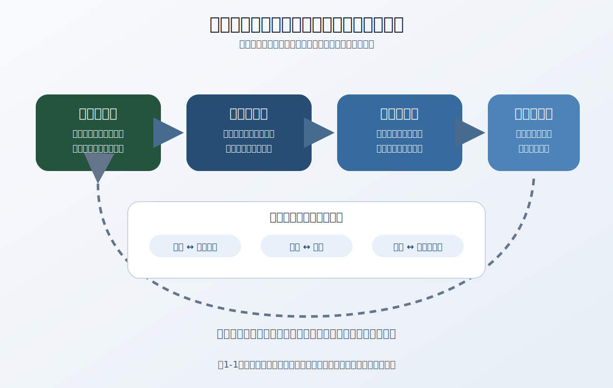

# 第1章　戦術判断を支える原則――状況に応じた適用

> **資料基準日：2026年7月13日／初稿**
>
> 本章は、米統合・陸軍ドクトリンを比較の基準として、原則を判断の問いへ変換する方法を扱う。個別の作戦手順や、特定の状況に対する推奨行動を示すものではない。

## 1　原則は「成功を保証する規則」ではない

原則は、過去の経験を圧縮した一般的な着眼点である。しかし、一般的であることと、どの状況にも同じ答えを与えることは別である。

米陸軍ADP 3-0（2025年3月21日）は、伝統的な九つの戦争原則に、抑制、持続、正統性を加えた十二の「統合作戦の原則」を示す。同時に、その関連性は状況ごとに異なり、**チェックリストではない**と明記する。原則の価値は、すべての項目へ同じ重みで印を付けることではなく、見落とした問い、競合する要求、説明できていない因果関係を発見することにある。

以下の日本語は本書の説明用訳であり、公定訳ではない。用語を厳密に比較するときは英語原語、国・軍種、版、発行日を併記する。

| 原語 | 本書での説明用訳 | 判断のための問い |
|---|---|---|
| Objective | 目的 | 行動は、明示された上位目的と望ましい状態にどう寄与するか。 |
| Offensive | 攻勢 | 誰が主導権を持ち、誰に選択を迫っているか。物理的な攻撃だけを意味していないか。 |
| Mass | 集中 | 決定的な時点・場所・対象へ、必要な効果をどう集中するか。 |
| Economy of Force | 戦力の節約 | 優先度の低い要求へ必要最小限を配し、重要な選択肢をどう残すか。 |
| Maneuver | 機動 | 位置、時間、情報、関係性の組合せによって、どの相対的な優位を作るか。 |
| Unity of Command | 指揮の統一 | 権限と責任は誰にあり、指揮権が及ばない相手とはどう努力を一致させるか。 |
| Security | 保全 | 人員、情報、能力、自由な選択を何から守る必要があるか。 |
| Surprise | 奇襲 | 相手の予期、時間感覚、前提をどこで外し得るか。こちらの前提も同時に疑っているか。 |
| Simplicity | 簡明性 | 情報や通信が欠けても、目的、役割、条件を理解し続けられるか。 |
| Restraint | 抑制 | 法、政策、倫理、民間への影響が許す範囲は何か。 |
| Perseverance | 持続 | 必要な期間、組織的・政治的な意思と資源を維持できるか。 |
| Legitimacy | 正統性 | 権限、目的、方法は、関係者から適法・正当なものとして理解され得るか。 |

「攻勢」と「主導権」、「集中」と単純な兵力の密集、「指揮の統一」と関係組織すべてへの指揮権は、それぞれ同じではない。訳語だけから意味を推測せず、原資料の定義と文脈へ戻る必要がある。

## 2　原則・特性・手順を混ぜない

同じ文書体系の中にも、抽象度と役割の異なる概念がある。

| 種類 | 役割 | 2026年7月時点の例 |
|---|---|---|
| 統合作戦の原則 | 幅広い状況で見落としを点検する一般的着眼点 | 目的、攻勢、集中、戦力の節約、機動、指揮の統一、保全、奇襲、簡明性、抑制、持続、正統性 |
| 作戦概念のtenets（本書では「望ましい特性」と説明） | 特定の作戦概念を構成・評価する属性 | 米陸軍MDOの機敏性（agility）、収斂（convergence）、持久力（endurance）、縦深（depth） |
| 戦術上の基本事項 | 攻勢、防勢、各種の実現支援的な活動を理解する共通基盤 | FM 3-90（2023年）の戦術体系 |
| 技法・手順 | 特定の組織、任務、装備、条件で実行を整える具体化 | 下位刊行物、命令、標準作業手順など |

ADP 3-0（2025年版）は、米陸軍MDOの**tenets**として機敏性、収斂、持久力、縦深を挙げる。本書の「望ましい特性」は説明用の分類であり、公定訳ではない。これらは十二原則の置換でも、すべての国のMDOに共通する定義でもない。さらに、ドクトリン上の原則は法令、政策、個別命令を上書きしない。分析では「どの概念を、誰が、何のために、どの版で用いているか」を先に確かめる。

## 3　原則間の緊張を読む

原則は互いに独立した採点項目ではない。ある原則を強く追求すると、別の要求に費用や危険が移ることがある。

- 効果を集中すれば、他の場所に配れる資源は減る。
- 主導権を求めてテンポを上げれば、保全、確認、兵站に使える時間が減り得る。
- 多国間・多領域の能力を細かく同期すれば、計画と通信は複雑になり得る。
- 指揮を統一しても、情報が一か所へ集まりすぎれば現場の判断が遅れ得る。
- 短期の成果を急げば、抑制、正統性、長期の持続を損ね得る。

したがって、問うべきなのは「どの原則を守ったか」だけではない。「どの緊張を認識し、何を優先し、どこへ危険を移し、その選択が上位目的に照らして説明できるか」である。

**図1-1　原則をチェックリストにしない。** 目的と状況を入力し、原則で盲点と緊張を探し、複数の仮説を比較する。実行後の結果は、前提と判断の双方を更新する。

## 4　状況を構成する要素

状況判断では、目に見える戦力だけでなく、行動の意味を変える条件を扱う。

| 観点 | 確認すること | 見直しの兆候 |
|---|---|---|
| 上位目的 | 達成したい状態、避けたい状態、評価する主体 | 目的同士の矛盾、政策・任務の変更 |
| 相手と他の主体 | 能力、意思、適応、誤認、民間・同盟・関係機関の行動 | 相手の反応が想定した因果関係と異なる |
| 環境 | 物理、情報、人間の各側面と、その相互作用 | 地形、通信、世論、組織関係の変化 |
| 時間 | 決定期限、準備、移行、回復に要する時間 | 予定より早い消耗、遅い効果発現 |
| 持続性 | 人員、補給、整備、輸送、通信、交代、回復 | 次の行動に必要な余力の低下 |
| 法・倫理・政治 | 権限、適用法、交戦規則、民間への影響、説明責任 | 権限・条件の変更、意図しない影響 |
| 情報 | 出所、時点、欠落、信頼度、反対情報 | 新情報が前提を崩す、通信・センサーが失われる |

この表も完成済みのチェックリストではない。目的は、事実、推定、仮定、未知を混ぜず、何が変われば判断を更新するかを明示することである。

## 5　摩擦、不確実性、危険

ADP 3-0（2025年版）は、戦争を人間の意思の衝突として扱い、危険、不確実性、偶然があらゆる軍事活動に内在するとする。また、ある階層で受容した危険が、上位・下位・隣接する組織へ別の危険を課し得ることに注意を促す。

不確実性は少なくとも四つに分けて考えられる。

1. **情報の不確実性**――観測が欠け、古く、偏り、欺瞞を含む可能性がある。
2. **因果の不確実性**――行動が期待した効果を生むとは限らない。
3. **実行の不確実性**――人、機器、通信、組織間調整が計画どおり働くとは限らない。
4. **帰結の不確実性**――局地的な結果が、政治、社会、同盟、次の活動へどう波及するか分からない。

数値を置くことだけで不確実性が消えるわけではない。危険の説明では、「何が起き得るか」「起きた場合にどの目的へ影響するか」「どの兆候で評価を変えるか」を結びつける。数値化できない影響や、他組織へ移した危険も残す。

## 6　攻勢・防勢・安定化・実現支援を関係で捉える

攻勢と防勢は、優劣を一語で決められる対立物ではない。ADP 3-0（2025年版）は、上位の編成ほど攻勢、防勢、安定化を組み合わせる可能性が高く、下位の編成ほど一時点では一種類へ集中しやすいと説明する。防勢は時間や条件を作り、攻勢への移行を可能にし得る。武力紛争下でも、法的・道義的・任務上必要な最低限の安定化任務は消えない。

FM 3-90（2023年5月1日）は、攻勢、防勢、そしてそれらを可能にする偵察、保全、移動、交代などの活動を一つの戦術体系にまとめた。ここから得るべき一般的な教訓は、名称を暗記することではなく、活動の**移行**と**持続**を見ることである。

- 現在の活動は、次のどの状態を作ろうとしているか。
- 成功・失敗・中止の後、何へ移行するのか。
- 移行に必要な情報、時間、補給、権限は残るか。
- 一つの場所の成果が、他の場所や上位目的へどの費用を課すか。
- 民間と関係組織への影響は、後の選択肢を狭めないか。

## 7　原則を使った分析手順

本書では、原則を次の順序で使う。

1. 上位目的と望ましい状態を一文で置く。
2. 事実、推定、仮定、未知を分ける。
3. 十二原則を使って、見落とした観点と原則間の緊張を探す。
4. 単一案を正当化せず、複数の説明・選択肢を比較する。
5. 危険が戦術・作戦・戦略、他組織、民間へどう移るかをたどる。
6. 観測できる指標と、判断を見直す兆候を先に決める。
7. 結果を複数の水準と時間幅で評価する。
8. 結果だけでなく、前提と判断過程を記録して学習へ戻す。

この手順の目的は、もっともらしい説明を作ることではない。反対情報が現れたときに、どの前提と判断を更新すべきか分かる状態を作ることである。

## 章末確認

1. 統合作戦の原則がチェックリストではないとは、どういう意味か。
2. 「攻勢」と「主導権」を同一視できない理由を説明できるか。
3. 集中と戦力の節約、簡明性と多組織連携の間に生じる緊張を一つ説明できるか。
4. 原則、MDOの特性、戦術上の基本事項、手順の違いを説明できるか。
5. ある階層で受容した危険が、別の階層や組織へ移る例を考えられるか。
6. 判断を見直す兆候を、実行前に置く利点は何か。

## 主要な公開資料

- [Joint Chiefs of Staff, JP 3-0, *Joint Campaigns and Operations*](https://www.jcs.mil/Doctrine/Joint-Doctrine-Pubs/3-0-Operations-Series/), 18 June 2022（2026年7月13日確認）。
- [Department of the Army, ADP 3-0, *Operations*](https://armypubs.army.mil/epubs/DR_pubs/DR_a/ARN43323-ADP_3-0-000-WEB-1.pdf), 21 March 2025, especially paras. 1-2–1-10, 3-13–3-22, 4-24, 4-28（2026年7月13日確認）。
- [Department of the Army, FM 3-90, *Tactics*](https://armypubs.army.mil/epubs/DR_pubs/DR_a/ARN38160-FM_3-90-000-WEB-1.pdf), 1 May 2023（2026年7月13日確認）。
- [Department of the Army, ADP 6-0, *Mission Command: Command and Control of Army Forces*](https://rdl.train.army.mil/catalog-ws/view/100.ATSC/1FE33715-CFD1-4614-A489-B3E0480C3F80-1428688882108/adp6_0.pdf), 31 July 2019（2026年7月13日、公式検索結果で書誌と本文を確認。配信サーバーへの直接接続は不安定）。
